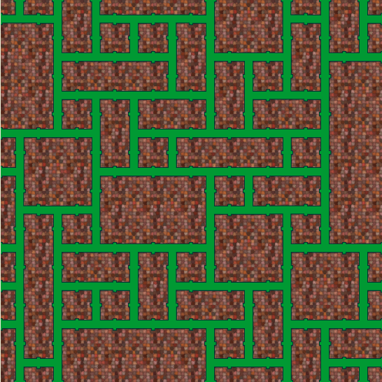
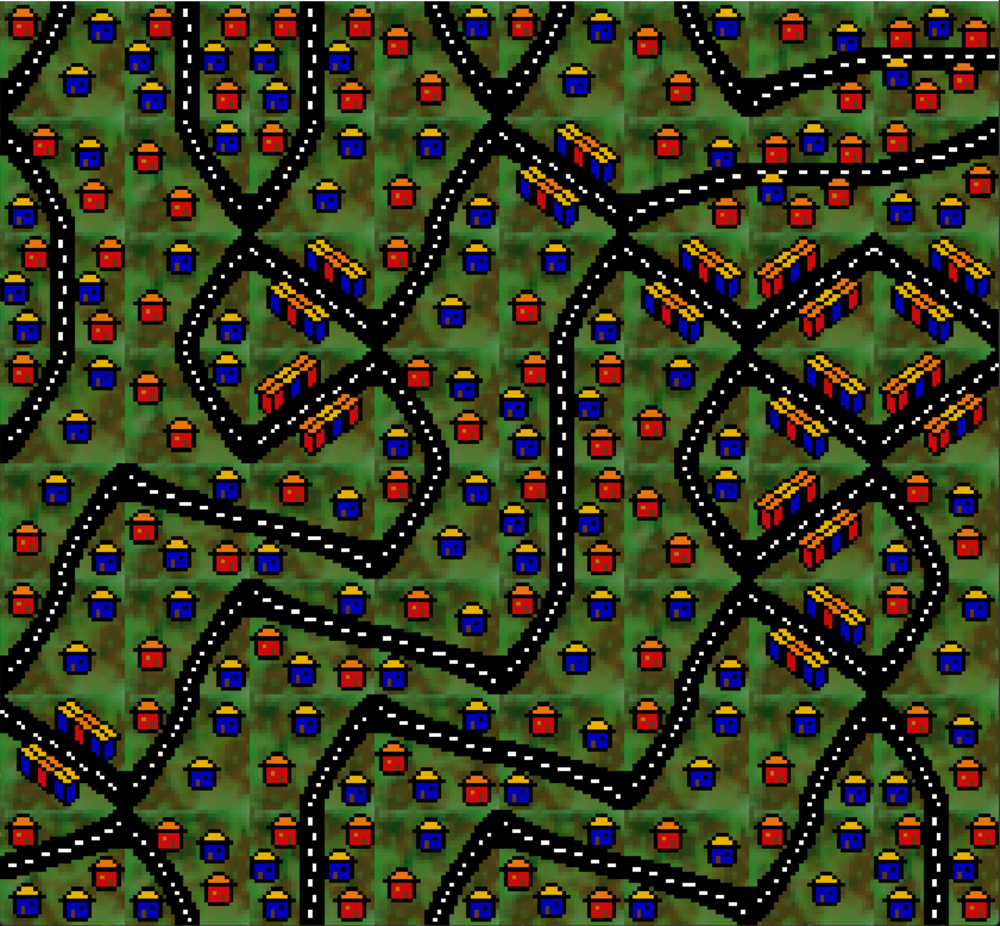

# WFC Path Generator with Custom Rules

This project is a Wave Function Collapse (WFC) path generator, designed to work with custom tile-based rules. The generator uses the SFML library to render tile maps based on the provided rules. The rules dictate how different tile types can be placed next to each other.

<table>
  <tr>
    <th>Pipes</th>
    <th>(Ugly) Houses</th>
  </tr>
  <tr>
    <td></td>
    <td></td>
  </tr>
</table>


## Setup and Build

To compile the project, ensure you have SFML installed and the appropriate paths set up. Run the following commands to build and compile the project:

g++ -c WFC.cpp -I<path_to_your_SFML_include>
g++ WFC.o -o WFC -L<path_to_your_SFML_lib> -lsfml-graphics -lsfml-window -lsfml-system

## Input Format

The input file defines the rules for tile placement and the size of the grid. Here's the format:

1. **First Row**:
   - Number of rules per side
   - Number of tile types
   - Name of the folder where tile images are stored

2. **Following Rows**:
   - For each tile type, specify the tile name followed by its rules for each side.
   - A tile's rules determine which other tiles it can connect to on each of its sides.

3. **Last Row**:
   - The size of the grid (table side size).

### Example Input

#### Pipes Configuration:
```text
3 5 Pipes
blank 0 0 0 0 0 0 0 0 0 0 0 0
down 0 0 0 0 1 0 0 1 0 0 1 0
left 0 1 0 0 0 0 0 1 0 0 1 0
right 0 1 0 0 1 0 0 1 0 0 0 0
up 0 1 0 0 1 0 0 0 0 0 1 0
8
```
```text
#### Houses Configuration:
3 12 Houses
1 0 0 0 1 0 0 0 0 0 1 0 0
2 0 0 0 0 0 1 0 0 0 0 0 1
3 0 0 0 0 1 0 0 0 0 0 1 0
4 0 1 0 0 0 0 0 1 0 0 0 0
5 0 0 0 1 0 0 0 0 0 0 1 0
6 0 0 0 0 1 0 0 0 0 0 0 1
7 0 0 0 0 1 0 0 0 0 1 0 0
8 0 0 0 0 0 1 0 0 0 0 1 0
9 0 1 0 0 0 0 0 0 0 1 0 0
10 0 1 0 0 0 1 0 0 0 0 0 0
11 0 0 0 1 0 0 0 1 0 0 0 0
12 0 0 0 0 0 0 0 1 0 0 0 1
8
```

## How it Works

- The WFC algorithm takes a set of predefined tiles and their rules, and it generates a valid configuration by choosing tiles that respect the adjacency rules.
- The input format allows for flexible and customizable configurations, supporting a wide variety of path generation possibilities.

## Requirements

- C++11 or higher
- SFML 2.5.1 or higher

## Usage

Once compiled, run the program and provide the input file as an argument to generate a path using the WFC algorithm with your custom rules.

./WFC input.txt

## Acknowledgements

This project is inspired by the Wave Function Collapse algorithm, popularized by Maxim Gumin's [WFC algorithm](https://github.com/mxgmn/WaveFunctionCollapse).

## License

This project is licensed under the MIT License.

---  

Enjoy!
